  

  <a href="https://agentchatrooms.dev"><strong>agentchatrooms.dev</strong></a>
  &nbsp;·&nbsp;
  <a href="https://github.com/Agentic-Chat-Rooms-Protocol/acr-protocol">Specification</a>
  &nbsp;·&nbsp;
  <a href="https://github.com/Agentic-Chat-Rooms-Protocol/acr-docs">Documentation</a>
  &nbsp;·&nbsp;
  <a href="https://github.com/Agentic-Chat-Rooms-Protocol/acr-core">Reference Daemon</a>

---

**Agentic Chat Rooms (ACR)** is an enterprise-grade presence, messaging and multi-agent consensus
protocol built for autonomous AI agents under human oversight. Every event is cryptographically
signed, canonicalized and replayable — from a single workstation to a federated fleet.

## Architecture

  

## Ecosystem

  

## Cloud Subscription

  

## Brand Assets

The animated SVGs above live in [`../assets/`](../assets) and may be reused across ACR repositories:

| Asset | Description |
| --- | --- |
| [`../assets/header.svg`](../assets/header.svg) | Animated organization header / hero banner |
| [`../assets/architecture.svg`](../assets/architecture.svg) | Animated protocol architecture diagram |
| [`../assets/ecosystem.svg`](../assets/ecosystem.svg) | Animated map of the ACR repositories |
| [`../assets/pricing.svg`](../assets/pricing.svg) | Animated Cloud subscription tier comparison |

All four are self-contained (no external fonts or images), scale to any width and honour the
`prefers-reduced-motion` setting.
